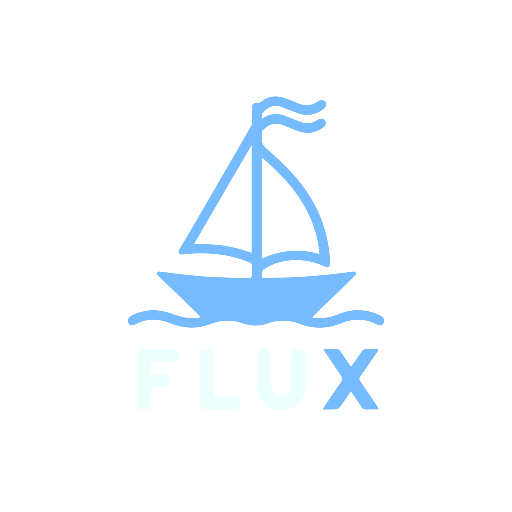

# **Effortless Workflows with Flux**

- Easy to use
- Can be learned in minutes
- All the basics components of a traditional programming language

---


# **Motivation**

- Create a simple and easy language that with a simple syntax.
- Join features of languages I find useful.

---


# **Characteristics**

- Loosely typed
- Interpreted
- Written in Go

---

# <!-- fit --> **Let's see some code!**

---

# **Hello World**

```flux
println "Hello World!";
```

---

# **Variables**

```flux
// simple declaration
a = 10;

// declaration with block
b = {
    x = 10;
    y = 20;
    return x + y;
};
```

---

# **Operators**

```flux
// arithmetic
println 1 + 1;
println 1 - 1;
println 1 * 1;
println 1 / 1;

// comparison
println 1 == 1;
println 1 > 1;
println 1 < 1;

// logical
println 1 and 1;
println 1 or 1;
println not 1;
```


---

# **Conditionals**

```flux 
if a > 10 {
    println "a is greater than 10";
} else {
    println "a is less than or equal to 10";
};
```

---

# **Loops**

```flux
// for loop
for i = 0; i < 10; i = i + 1 {
    println i;
};

// while loop
for ; a < 10; {
    println a;
    a = a + 1;
};

// infinite loop
for ;; {
    println "infinite loop";
    return; // exits from the program
};
```

---

# **Functions**

```flux
add -> a, b {
    return a + b;
};

println add(1, 2);
```
